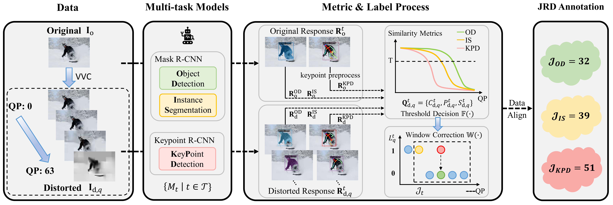
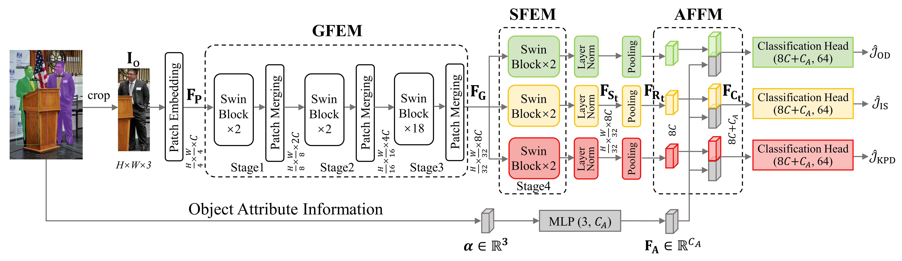

# MT-JRD


[](https://arxiv.org/abs/2604.09421)

**Multi-task Just Recognizable Difference for Video Coding for Machines: Database, Model, and Coding Application**  
[[paper]](https://arxiv.org/abs/2604.09421) [[code]](https://github.com/SYSU-Video/MT-JRD) [[dataset]](https://ieee-dataport.org/documents/mt-jrd-multi-task-just-recognizable-difference-dataset-video-coding-machines)  
[Junqi Liu](https://scholar.google.com.sg/citations?user=F-xSi9UAAAAJ&hl=en&oi=sra), [Yun Zhang](https://scholar.google.com.sg/citations?user=tZp-uVoAAAAJ&hl=en&oi=sra), Xiaoxia Huang, [Long Xu](https://scholar.google.com.sg/citations?hl=en&user=PBqivgkAAAAJ&view_op=list_works&sortby=pubdate), [Weisi Lin](https://scholar.google.com.sg/citations?user=D_S41X4AAAAJ&hl=en&oi=sra)  
*arXiv preprint, 2026*

## Abstract

Just Recognizable Difference (JRD) boosts coding efficiency for machine vision through visibility threshold modeling, but is currently limited to a single-task scenario. To address this issue, we propose a Multi-Task JRD (MT-JRD) dataset and an Attribute-assisted MT-JRD (AMT-JRD) model for Video Coding for Machines (VCM), enhancing both prediction accuracy and coding efficiency. First, we construct a dataset comprising 27,264 JRD annotations from machines, supporting three representative tasks including object detection, instance segmentation, and keypoint detection. Secondly, we propose the AMT-JRD prediction model, which integrates Generalized Feature Extraction Module (GFEM) and Specialized Feature Extraction Module (SFEM) to facilitate joint learning across multiple tasks. Thirdly, we innovatively incorporate object attribute information into object-wise JRD prediction through the Attribute Feature Fusion Module (AFFM), which introduces prior knowledge about object size and position. This design effectively compensates for the limitations of relying solely on image features and enhances the model capacity to represent the perceptual mechanisms of machine vision. Finally, we apply the AMT-JRD model to VCM, where the accurately predicted JRDs are applied to reduce the coding bit rate while preserving accuracy across multiple machine vision tasks. Extensive experimental results demonstrate that AMT-JRD achieves precise and robust multi-task prediction with a mean absolute error of 3.781 and error variance of 5.332 across three tasks, outperforming the state-of-the-art single-task prediction model by 6.7% and 6.3%, respectively. Coding experiments further reveal that compared to the baseline VVC and JPEG, the AMT-JRD-based VCM improves an average of 3.861% and 7.886% Bjontegaard Delta-mean Average Precision (BD-mAP), respectively.

## Requirements

This project was developed with Python 3.10 and PyTorch. Install the required packages with:

```bash
pip install -r requirements.txt
```

## Project Directory Structure

```text
MT-JRD/
├── code/
│   ├── dataset.py
│   ├── model.py
│   ├── test.py
│   ├── train.py
│   └── utils.py
├── figures/
│   ├── dataset.png
│   └── model.png
├── README.md
└── requirements.txt
```

## MT-JRD Dataset

The [MT-JRD dataset](https://ieee-dataport.org/documents/mt-jrd-multi-task-just-recognizable-difference-dataset-video-coding-machines) is constructed from 4,348 COCO images. Each source image is compressed by VVC at 64 quantization parameters. Mask R-CNN is used for OD and IS, while Keypoint R-CNN is used for KPD. The responses of the original and distorted images are compared using category, confidence, and task-specific similarity, namely bounding-box IoU for OD, mask IoU for IS, and Object Keypoint Similarity for KPD. A threshold of 0.75 and a sliding-window correction strategy are then used to determine the JRD.

The dataset contains 9,088 object samples and 27,264 JRD annotations across the three tasks. The samples are divided into training, validation, and test sets with 7,274, 912, and 902 samples, respectively.

<p align="center">
  
</p>

After downloading the dataset, organize it as follows:

```text
MT-JRD/
├── images/
│   ├── original/
│   │   └── {object_id}.png
│   └── distorted/
│       └── {object_id}/
│           ├── {object_id}_0.png
│           ├── ...
│           └── {object_id}_63.png
└── infos/
    ├── three_JRD_info.json
    ├── object_attributes.json
    ├── train_names.json
    ├── val_names.json
    └── test_names.json
```

- `three_JRD_info.json` stores the three JRD labels of each object in the order **KPD, OD, IS**.
- `object_attributes.json` stores the object size and position attributes used by AMT-JRD.
- `train_names.json`, `val_names.json`, and `test_names.json` define the official dataset split.
- `images/original` contains the original object images used to train and test the no-reference AMT-JRD model.
- `images/distorted` contains the 64 VVC-compressed versions of every object image.

## AMT-JRD Model

AMT-JRD is a Swin Transformer-based multi-task model. Its Generalized Feature Extraction Module (GFEM) shares the first three Swin stages to learn common distortion-related representations. Three Specialized Feature Extraction Modules (SFEMs), implemented as task-specific fourth stages, learn features for OD, IS, and KPD. The Attribute Feature Fusion Module (AFFM) embeds object size and position information and fuses it with each task-specific visual representation before classification.

<p align="center">
  
</p>

The model predicts all three JRDs in one forward pass. During training, the three task losses are weighted equally, and all model parameters are fine-tuned.

### Pretrained Weights

The ImageNet-22K pretrained Swin-S checkpoint used for initialization can be downloaded from the [official Swin Transformer repository](https://github.com/microsoft/Swin-Transformer). The trained AMT-JRD checkpoint will be released [here]().

## Train

```bash
python code/train.py \
  --data_root /path/to/MT-JRD \
  --weights /path/to/swin_small_patch4_window7_224_22k.pth \
  --output_dir ./checkpoints/amt_jrd \
  --epochs 20 \
  --batch_size 32 \
  --lr 1e-5 \
  --gpus 0 \
  --device cuda:0
```

The best checkpoint is selected according to the equally averaged validation MAE of KPD, OD, and IS.

## Test

```bash
python code/test.py \
  --data_root /path/to/MT-JRD \
  --checkpoint ./checkpoints/amt_jrd/amt_jrd_best.pth \
  --output_dir ./results \
  --gpus 0 \
  --device cuda:0
```

The test script reports $E_A$, $E_{[27,51]}$, and $\sigma_e$ for OD, IS, and KPD, together with their task averages. It also saves the metrics and per-sample predictions to `metrics.json` and `predictions.csv`.

## Coding Application

For detailed instructions, please refer to [DT-JRD](https://github.com/JunqiLiu-SYSU/DT-JRD).

## Citation

If you find this work useful, please cite:

```bibtex
@article{liu2026multitask,
  title={Multi-task Just Recognizable Difference for Video Coding for Machines: Database, Model, and Coding Application},
  author={Liu, Junqi and Zhang, Yun and Huang, Xiaoxia and Xu, Long and Lin, Weisi},
  journal={arXiv preprint arXiv:2604.09421},
  year={2026}
}
```
